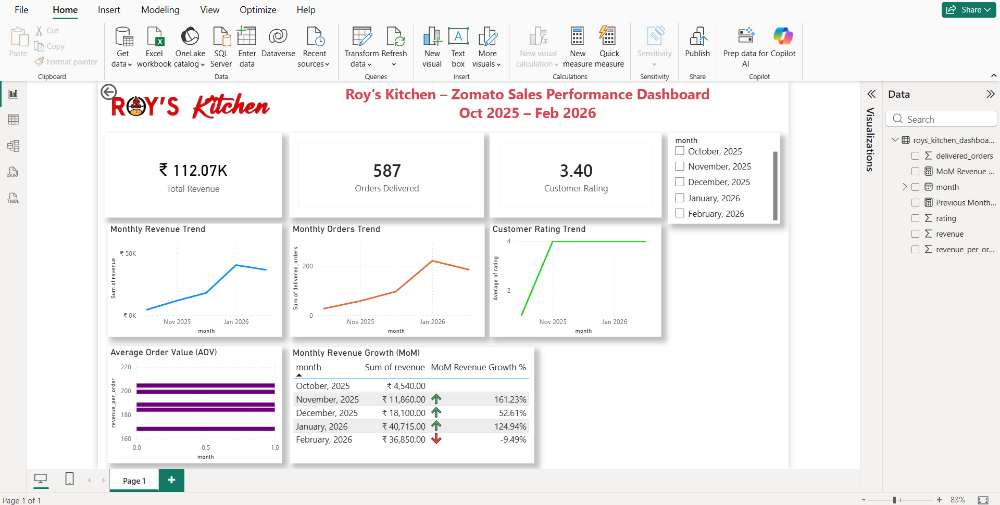

# Roy's Kitchen – Zomato Sales Performance Dashboard

## Project Overview

This project presents a Power BI dashboard analyzing Zomato sales performance for Roy's Kitchen.
The dashboard provides insights into revenue trends, order volume, customer ratings, and month-over-month growth to help monitor business performance and support data-driven decisions.

The analysis covers sales data from **October 2025 to February 2026**.

---

## Dashboard Preview

---

## Key Metrics

The dashboard tracks the following important business metrics:

* **Total Revenue**
* **Orders Delivered**
* **Customer Rating**
* **Average Order Value (AOV)**
* **Month-over-Month Revenue Growth (MoM)**

---

## Dashboard Insights

Some key insights derived from the dashboard:

* Revenue increased steadily from **October 2025 to January 2026**.
* **January 2026 recorded the highest revenue and order volume**.
* **February 2026 saw a slight decline in revenue (-9.49% MoM)**.
* Customer ratings improved significantly after October.
* Average order value remained relatively stable across the months.

---

## Dashboard Features

The Power BI dashboard includes:

* KPI Cards for revenue, orders, and ratings
* Monthly Revenue Trend Analysis
* Monthly Orders Trend
* Customer Rating Trend
* Average Order Value Visualization
* Month-over-Month Revenue Growth with Conditional Formatting

---

## Tools & Technologies Used

* **Power BI** – Data visualization and dashboard creation
* **DAX (Data Analysis Expressions)** – Calculations and metrics
* **Excel / CSV Dataset** – Data source
* **Data Visualization & Business Analytics**

---

## Files in this Repository

| File Name | Description |
|-----------|-------------|
| roys_kitchen_sales_dashboard.pbix | Power BI dashboard file |
| roys_kitchen_dashboard_data.csv | Dataset used for analysis |
| dashboard.png | Screenshot of the dashboard |
| README.md | Project documentation |

---

## Business Use Case

This dashboard demonstrates how restaurant businesses can use data analytics to monitor sales performance, track customer satisfaction, and identify revenue trends for better decision-making.

---

## Author

**Amit Roy**
Data Analytics Enthusiast | SQL | Power BI | Data Visualization

